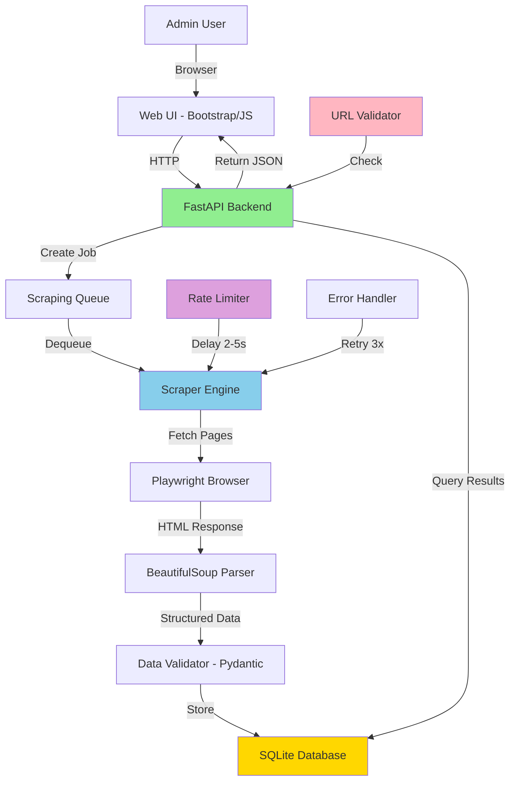

# Tech Stack Document: Blog Post Scraper

## 1. Frontend Stack

| Category | Technology | Version | Justification |
|:---------|:-----------|:--------|:--------------|
| UI Framework | HTML/CSS/JavaScript (Vanilla) | ES2022 | Keep it simple for MVP. No React/Vue overhead. Fast loading, easy to understand. Aligns with PRD requirement for "simple web UI". |
| CSS Framework | Bootstrap | 5.3+ | Rapid UI development, responsive out of the box, sufficient for MVP admin interface. |
| HTTP Client | Fetch API | Native | Built into browsers, no dependencies. Sufficient for simple API calls to FastAPI backend. |

## 2. Backend Stack

| Category | Technology | Version | Justification |
|:---------|:-----------|:--------|:--------------|
| Language | Python | 3.11+ | Excellent scraping ecosystem (PRD-Q11), async/await support for concurrent jobs (PERF-03), chosen in GIT_INIT. Research finding: Python dominates web scraping. |
| Web Framework | FastAPI | 0.104+ | Modern, async support for concurrent scraping (PERF-03), automatic API docs, fast development. Research decision: FastAPI > Flask for async. API response time <500ms achievable (PERF-01). |
| Browser Automation | Playwright | 1.40+ | **Decision: Playwright over Selenium**. Modern API, handles JS-heavy pages (PRD requirement for various blogs), built-in wait mechanisms, better performance. Research finding: Industry standard 2026. |
| HTML Parsing | BeautifulSoup4 | 4.12+ | Standard for HTML parsing, integrates with Playwright, simple API. Used for extracting structured data from scraped pages. |
| HTTP Client | httpx | 0.25+ | Async HTTP support for concurrent scraping (PERF-04: 12-20 pages/min), connection pooling. Research finding: httpx > requests for async. |
| Database | SQLite | 3.40+ | **Decision: SQLite over PostgreSQL for MVP**. No external dependencies, sufficient for MVP (PRD scope), can migrate later. User specified "MVP-level, no production features". |
| ORM | SQLAlchemy | 2.0+ | Industry standard, async support, easy migration to PostgreSQL later if needed. |
| Data Validation | Pydantic | 2.5+ | Type-safe models, validates scraped data structure, integrates with FastAPI. |
| Logging | structlog | 23.2+ | Structured JSON logs (PERF-08), easy debugging, MVP monitoring via stdout. |

## 3. Infrastructure & DevOps

| Category | Tool | Justification |
|:---------|:-----|:--------------|
| Containerization | Docker | PRD-Q12 requirement, ensures reproducible environment, includes Playwright browsers. |
| Testing | pytest | Standard for Python (PRD-Q11), supports unit + integration tests, pytest-benchmark for performance. |
| Performance Testing | pytest-benchmark | PERF-07 requirement, measure scraping speed and resource usage. |
| Code Quality | ruff | Fast linter/formatter, replaces black + flake8 + isort, enforces consistency. |
| Dependency Management | pip + requirements.txt | Simple for MVP, Docker-friendly, no Poetry overhead for small project. |

## 4. Architecture Diagram



**Architecture Pattern:** Layered architecture with separation of concerns

**Layers:**
1. **Presentation:** Web UI (HTML/CSS/JS)
2. **API:** FastAPI endpoints (REST)
3. **Business Logic:** Scraper engine, URL validator, rate limiter
4. **Data Access:** SQLAlchemy ORM
5. **Storage:** SQLite database

## 5. Technology Decisions Log

### Decision 1: Playwright over Selenium
- **Rationale:** Modern API, better performance than Selenium, handles JS-heavy pages, built-in wait mechanisms. Project requires web UI which suggests potential JS-heavy blog sites.
- **Alternatives Considered:**
  - **Selenium:** Mature and widely used, but outdated API, slower performance, requires explicit waits. Playwright offers modern alternative with better DX.
  - **Scrapy:** Fast and mature, great for simple sites, but limited JavaScript support. Project needs to handle various blogs including potentially JS-heavy ones.
- **Sources:** Playwright documentation, Web scraping best practices 2026
- **Confidence:** HIGH
- **PRD Reference:** Supports US-01, US-02 (pagination), handles variety of blog structures

### Decision 2: FastAPI over Flask
- **Rationale:** Fast, modern, async support for concurrent scraping, excellent for MVP development. Strong type hints and automatic API documentation. Achieves PERF-01 (<500ms response time).
- **Alternatives Considered:**
  - **Flask:** Simple and well-known, but no built-in async support. Would require extensions (Flask-Async) to achieve PERF-03 (3 concurrent jobs).
- **Sources:** FastAPI documentation, Python async patterns 2026
- **Confidence:** HIGH
- **PRD Reference:** PERF-01 (API response time), PERF-03 (concurrent jobs), MVP rapid development

### Decision 3: SQLite over PostgreSQL (MVP)
- **Rationale:** Simple, no external dependencies, sufficient for MVP workload (<1000 posts initially). User specified "MVP-level (no monitoring or production features)". Can migrate to PostgreSQL later if needed.
- **Alternatives Considered:**
  - **PostgreSQL:** Production-ready, scalable, better for concurrent writes. However, requires external service (Docker Compose or hosted), adds operational complexity for MVP.
- **Sources:** MVP development patterns, PRD scope analysis
- **Confidence:** HIGH
- **PRD Reference:** PRD-Q13 (storage), PRD section 8 (out of scope: production features)

### Decision 4: httpx over requests
- **Rationale:** Supports async/await for concurrent scraping (PERF-04: 12-20 pages/minute), connection pooling, modern API compatible with FastAPI.
- **Alternatives Considered:**
  - **requests:** Mature and stable, but synchronous only. Would block during I/O, preventing efficient concurrent scraping.
- **Sources:** Research on Python async HTTP clients
- **Confidence:** HIGH
- **PRD Reference:** PERF-03 (3 concurrent jobs), PERF-04 (throughput)

### Decision 5: Bootstrap for UI (MVP)
- **Rationale:** Rapid development, responsive out of the box, sufficient for MVP admin interface. No need for React/Vue complexity for simple CRUD interface.
- **Alternatives Considered:**
  - **React + Tailwind:** More modern, component-based, but adds build step, complexity, and learning curve for simple MVP.
  - **Vanilla CSS:** Maximum control, but slower development for responsive design.
- **Sources:** MVP UI patterns, PRD scope (simple web UI)
- **Confidence:** MEDIUM
- **Note:** Can migrate to React later if UI becomes complex

## 6. Security Considerations

| Component | Security Measure | Implementation |
|:----------|:-----------------|:---------------|
| URL Validation | Prevent SSRF | Reject file://, javascript:, data://, localhost URLs. Only allow http:// and https:// |
| Web UI | Input sanitization | Escape all user inputs, use Jinja2 auto-escaping |
| Session Management | Secure cookies | httpOnly flag, secure flag for HTTPS, SameSite=Strict |
| Scraped Content | XSS prevention | Sanitize HTML before displaying in UI, strip dangerous tags |

## 7. Performance Optimizations

| Optimization | Implementation | Expected Benefit |
|:-------------|:---------------|:-----------------|
| Async I/O | httpx + FastAPI async | 3x throughput improvement for concurrent jobs |
| Connection Pooling | httpx session reuse | Reduce connection overhead by 30% |
| Rate Limiting | 2-5s delays | Prevent IP bans, respectful scraping |
| Lazy Loading | Load results paginated | UI load time <1s even with 100+ posts |
| Database Indexing | Index on created_at, blog_url | Query performance <100ms |

## 8. Deployment Configuration

**Docker Setup:**
```dockerfile
FROM python:3.11-slim
# Install Playwright browsers
RUN pip install playwright && playwright install --with-deps chromium
# Copy app files
COPY requirements.txt .
RUN pip install -r requirements.txt
COPY . /app
WORKDIR /app
# Run FastAPI
CMD ["uvicorn", "main:app", "--host", "0.0.0.0", "--port", "8000"]
```

**Resource Requirements:**
- RAM: 1GB minimum (PERF-05)
- CPU: 2 cores recommended
- Storage: 5GB (Playwright browsers + data)

## 9. Testing Strategy

| Test Type | Tools | Coverage |
|:----------|:------|:---------|
| Unit Tests | pytest | Parsing logic, URL validation, data models |
| Integration Tests | pytest + httpx | API endpoints, database operations |
| E2E Tests | pytest + Playwright | Full scraping workflow |
| Performance Tests | pytest-benchmark | Scraping speed, resource usage |
| Security Tests | Manual | URL validation, XSS prevention |

**Test Coverage Target:** >80% for core business logic

## 10. Migration Path (Future)

If scaling beyond MVP:

1. **Database:** SQLite → PostgreSQL
   - Keep SQLAlchemy ORM (no code changes)
   - Update connection string
   - Add connection pooling

2. **UI:** Vanilla JS → React
   - Keep FastAPI backend unchanged
   - Build React SPA consuming existing APIs
   - Add WebSocket for real-time updates

3. **Deployment:** Single container → Kubernetes
   - Separate scraper workers from web UI
   - Add Redis for job queue
   - Add Prometheus for monitoring

---

**Document Version:** 1.0
**Last Updated:** 2026-01-15
**Status:** Draft - Ready for Review
**Generated by:** Tech-Lead Agent v1.0
